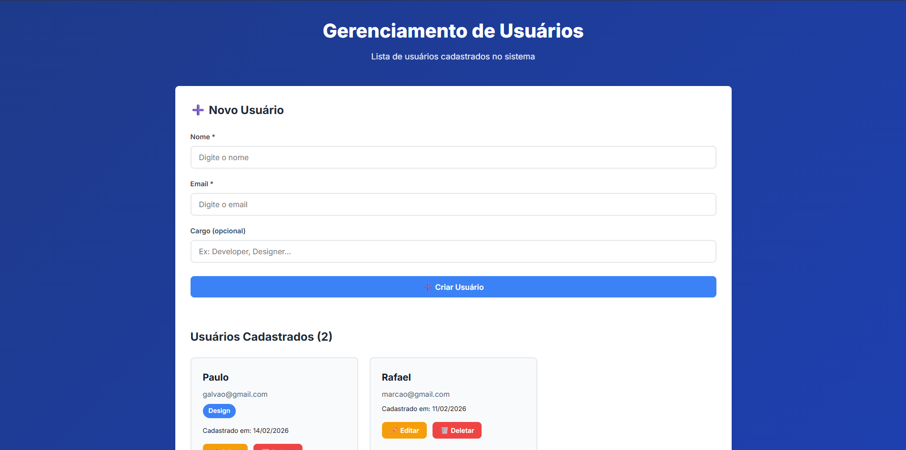

# 🧪 CRUD de Usuários - Full Stack

Aplicação full-stack para gerenciamento de usuários (CRUD completo) desenvolvida como teste técnico.

## 📋 Sobre o Projeto

Sistema completo de gerenciamento de usuários com:
- API REST em Node.js + Express
- Interface web em React
- Banco de dados PostgreSQL
- Docker para containerização

## 🚀 Tecnologias Utilizadas

### Backend
- Node.js + Express
- PostgreSQL
- Docker
- pg (driver PostgreSQL)

### Frontend
- React 18
- Vite
- Axios
- CSS3

## 📁 Estrutura do Projeto
```
teste-fullstack/
├── Backend/          # API REST
│   ├── src/
│   ├── db/
│   ├── docker-compose.yml
│   └── README.md
├── Frontend/         # Interface React
│   ├── src/
│   └── README.md
└── README.md         # Este arquivo
```

## 🔧 Instalação Completa

### Pré-requisitos

- [Node.js](https://nodejs.org/) v18+
- [Docker Desktop](https://www.docker.com/products/docker-desktop/)
- [Git](https://git-scm.com/)

### 1. Clone o repositório
```bash
git clone <url-do-repositorio>
cd teste-fullstack
```

### 2. Configure o Backend
```bash
cd backend
npm install
cp .env.example .env
docker-compose up -d
npm run dev
```

O backend estará rodando em: **http://localhost:3000**

### 3. Configure o Frontend

Em outro terminal:
```bash
cd frontend
npm install
npm run dev
```

O frontend estará rodando em: **http://localhost:5173**

## ✨ Funcionalidades

- ✅ Listar todos os usuários
- ➕ Criar novo usuário
- ✏️ Editar usuário existente
- 🗑️ Deletar usuário
- 🔍 Validação de dados (frontend e backend)
- 🎨 Interface moderna e responsiva
- 📱 Design mobile-first

## 📡 API Endpoints

| Método | Endpoint          | Descrição              |
|--------|-------------------|------------------------|
| GET    | /api/users        | Lista todos os usuários|
| GET    | /api/users/:id    | Busca usuário por ID   |
| POST   | /api/users        | Cria novo usuário      |
| PUT    | /api/users/:id    | Atualiza usuário       |
| DELETE | /api/users/:id    | Deleta usuário         |

## 🗄️ Modelo de Dados
```typescript
{
  id: number,           // Gerado automaticamente
  name: string,         // Obrigatório
  email: string,        // Obrigatório e único
  role?: string,        // Opcional
  created_at: Date      // Gerado automaticamente
}
```

## 🧪 Testando a Aplicação

### 1. Certifique-se de que tudo está rodando:
```bash
# Terminal 1 - Backend
cd backend
npm run dev

# Terminal 2 - Frontend
cd frontend
npm run dev
```

### 2. Acesse a aplicação:

Abra o navegador em: **http://localhost:5173**

### 3. Teste os cenários:

- ✅ Criar usuário com dados válidos
- ❌ Tentar criar sem email (vai gerar erro)
- ❌ Tentar criar com email duplicado (vai dar erro 409)
- ✏️ Editar um usuário existente
- 🗑️ Deletar um usuário

## 📸 Screenshots

### Tela Principal


## 🐳 Docker

O banco de dados PostgreSQL roda em container Docker:
```bash
# Iniciar
docker-compose up -d

# Parar
docker-compose down

# Ver logs
docker-compose logs -f
```

## 🛠️ Scripts Úteis

### Backend
```bash
npm run dev      # Modo desenvolvimento
npm start        # Modo produção
```

### Frontend
```bash
npm run dev      # Modo desenvolvimento
npm run build    # Build para produção
npm run preview  # Preview do build
```

## 📚 Documentação Detalhada

Para mais informações sobre cada parte do projeto:

- [Backend README](./Backend/README.md)
- [Frontend README](./Frontend/README.md)

## 🔒 Validações Implementadas

### Frontend
- Nome obrigatório
- Email obrigatório e formato válido
- Feedback visual em tempo real

### Backend
- Nome obrigatório (não vazio)
- Email obrigatório (não vazio)
- Email com formato válido (regex)
- Email único (verificação no banco)
- Tratamento de erros com status HTTP corretos

## 🚀 Deploy

### Backend (exemplo com Render)
```bash
# Build command
npm install

# Start command
npm start
```

### Frontend (exemplo com Vercel)
```bash
npm run build
```

Não esqueça de configurar a variável `baseURL` no frontend para apontar para a URL de produção da API.

## ⚙️ Variáveis de Ambiente

### Backend (.env)
```env
DB_HOST=localhost
DB_PORT=5432
DB_USER=admin
DB_PASSWORD=admin123
DB_NAME=users_crud
PORT=3000
NODE_ENV=development
```

## 🤝 Contribuindo

Contribuições são bem-vindas! Por favor:

1. Fork o projeto
2. Crie uma branch para sua feature (`git checkout -b feature/AmazingFeature`)
3. Commit suas mudanças (`git commit -m 'Add some AmazingFeature'`)
4. Push para a branch (`git push origin feature/AmazingFeature`)
5. Abra um Pull Request

## 📄 Licença

Este projeto está sob a licença MIT.

## 🙏 Agradecimentos

- Desenvolvido como parte do processo seletivo

---